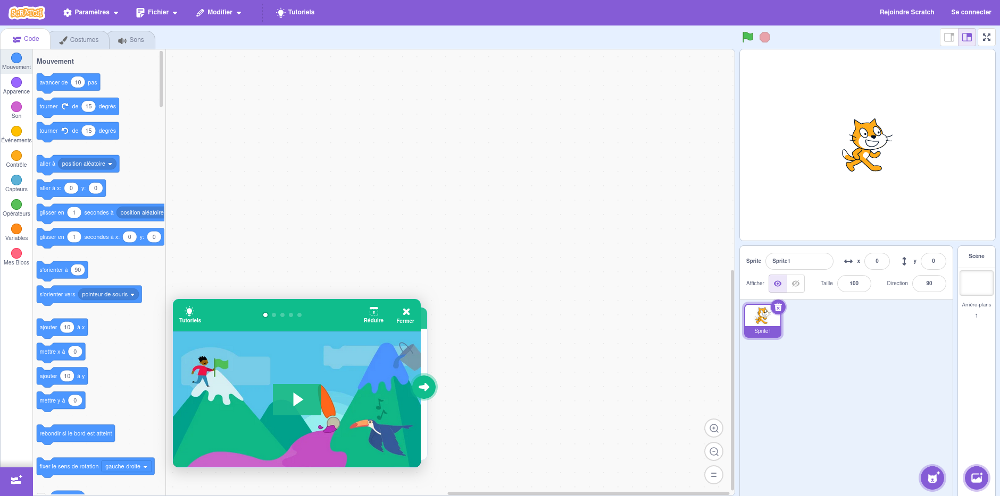
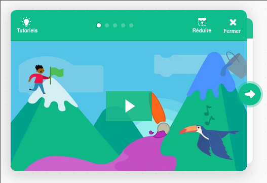
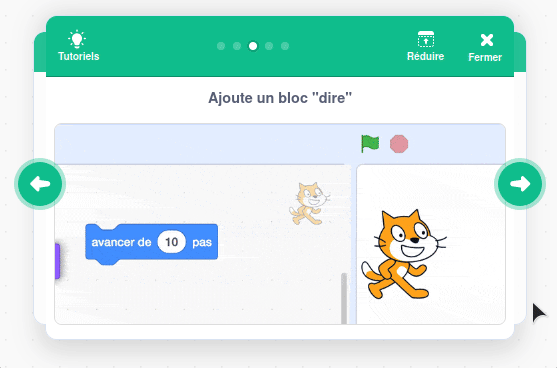
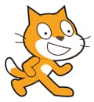
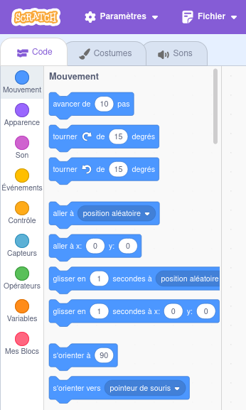
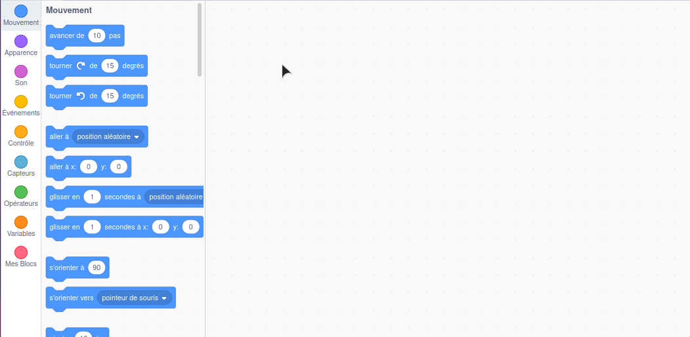
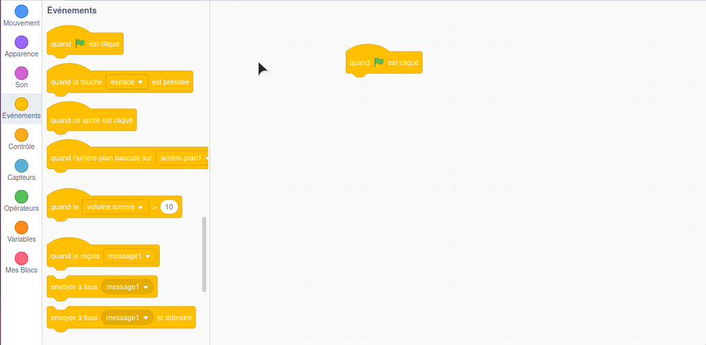
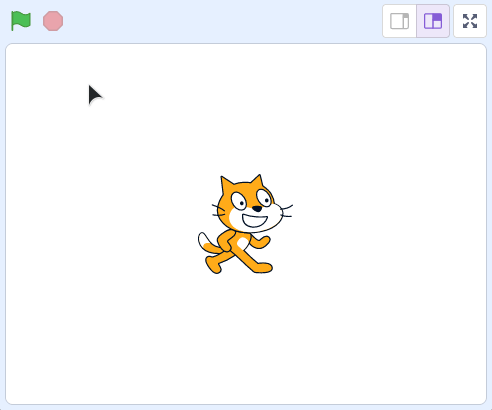
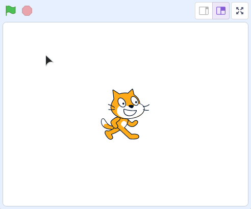
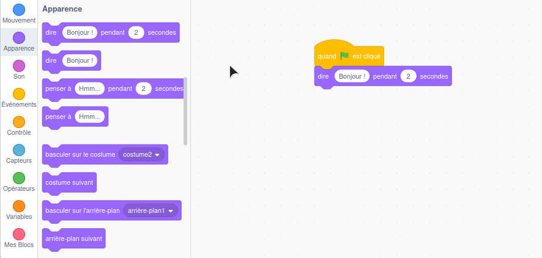

# Scratch

Pour utiliser Scratch, rendez-vous à l'adresse [https://scratch.mit.edu/projects/editor/?tutorial=getStarted](https://scratch.mit.edu/projects/editor/?tutorial=getStarted).

Vous devriez arriver sur cette page :

## Tutoriel

Pour découvrir rapidement comment fonctionne Scratch, commencez par regarder la vidéo "tutoriel" dans l'encart vert :

Comme vous pouvez le voir, pour créer un programme avec Scratch (qu'on appelle un script) on assemble des blocs entre-eux :

## Les objets (Lutin ou arrière-plan)

Les lutins sont des objets manipulés par Scratch. Par défaut, le chat ci-dessous est le seul lutin chargé :

On peut charger plusieurs lutins, les faire interagir, changer leur "costume", les déplacer à l'écran. Chaque lutin a son propre script composé de plusieurs blocs d'instructions.

On peut également ajouter des images d'arrière-plan.

Nous n'aurons pas besoin de manipuler les lutins et arrière-plans dans cet atelier, on peut passer à la suite.

## Les blocs d'instructions

Sur la gauche de l'interface, vous retrouverez tous les blocs à notre disposition, rangés dans plusieurs catégories.

Pour créer nos scripts, nous allons assembler ces blocs d'une certaine façon. Tous les blocs ne peuvent pas s'assembler ensemble !

## Notre premier programme Scratch

Le mieux pour comprendre, c'est de pratiquer ! Alors c'est parti, créons notre premier programme Scratch.

### Premier bloc

On veut que notre programme démarre quand l'utilisateur appuie sur le drapeau vert, le premier bloc qu'on va déposer est donc le bloc `quand 🚩 est cliqué`.

Il se situe dans la catégorie `Événements`. Faites glisser ce bloc sur l'écran principal :

### Deuxième bloc

On va ensuite ajouter un bloc `dire XXX pendant X secondes`, depuis la catégorie `Apparence` :

> [!NOTE]
> Le bloc `dire XXX pendant X secondes` doit être connecté au bloc `quand 🚩 est cliqué` que l'on a ajouté précédemment.

### Lancement du programme

On peut ensuite appuyer sur le drapeau vert en haut à droite, le chat devrait nous dire bonjour !

Quand on clique sur le drapeau, le programme se lance, **les blocs d'instructions sont traités un par un** par Scratch, puis le programme se stoppe. On peut le relancer en cliquant à nouveau sur le drapeau.

> [!NOTE]
> On peut forcer l'arrêt d'un programme en cours en appuyant sur le bouton rouge à droite du drapeau.

> C'est tout ? Pas génial ce premier programme ...

Je vous l'accorde, c'est très basique pour l'instant, et on va aller un peu plus loin juste après. Pour votre culture, ce qu'on vient de faire s'appelle ... un **Hello World** !

[Il est très courant de faire ce genre de programme très basique](https://fr.wikipedia.org/wiki/Hello_world) quand on teste un nouveau langage de programmation. En général, on se contente d'afficher "Hello world" à l'écran ou dans notre cas, "Bonjour !".

## Deuxième programme

Essayez d'ajouter 2 nouveaux blocs `dire XXX pendant X secondes`. Utilisez le premier bloc pour dire votre nom, et le deuxième pour dire une phrase de votre choix.

Lancez ensuite le programme, vous devriez voir les 3 messages apparaitre successivement :

Vous bloquez ? 😬 La solution par ici !

Il faut glisser/déposer deux nouveaux blocs `dire XXX pendant X secondes`, les connecter, et modifier leur texte :

## La suite

> OK, on a compris les bases, ensuite ?

On va découvrir un premier concept de programmation très important : les **variables** !

Ça se passe par [ici](./02-variables.md).
