# Les variables

En programmation, quelque-soit le langage utilisé, il existe des concepts, des "briques" élémentaires qui sont universels. Les variables en font partie !

Une variable va nous permettre de **stocker une donnée dans la mémoire temporaire de notre ordinateur** (mémoire vive, on parle souvent de "RAM").

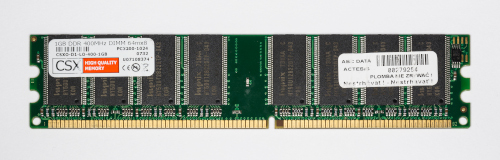  
_Ça ressemble à ça, une barette de RAM !_

Cette donnée va pouvoir être du texte, un nombre, ou d'autres types de donnée que nous découvrirons par la suite.

On peut par exemple **stocker notre prénom dans une variable** !

## Notre première variable avec Scratch

On va améliorer un peu notre programme précédent, en créant une nouvelle variable pour stocker notre prénom.

Rendez-vous dans la catégorie `Variables`, et cliquez sur le bouton `Créer une variable` tout en haut :

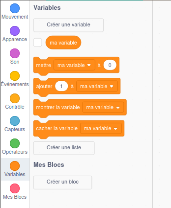

Une fenêtre popup nous demande de choisir un nom pour notre variable. **Toutes les variables doivent avoir un nom**, c'est ce qui nous permettra de les identifier quand nous en aurons créé plusieurs.

Choisissez le nom de variable `prenom`, puis appuyez sur le bouton `Ok` :

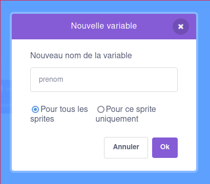

> [!NOTE]
> Vous l'aurez peut-être remarqué, je n'ai pas mis d'accent au nom de ma variable.
> Ce n'est pas une erreur, c'est juste qu'**en programmation, on évite d'utiliser des accents !**
>
> 

> 
Et si on veut vraiment utiliser des accents ?

> 
> En réalité, Scratch le permet. Par contre **attention** ⚠️, ce n'est pas le cas de la plupart des langages de programmation, qui **déclencheront une erreur** si vous essayez quand-même de le faire.
> 
> Autant prendre de bonnes habitudes dès maintenant. 📝
> 
> 

Un encart est apparu en haut à gauche, dans l'écran où se trouve le chat :

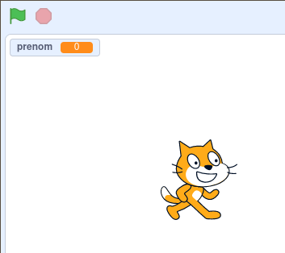

Cet encart nous affiche à tout moment la valeur stockée à l'intérieur de notre variable `prenom`. On peut voir que par défaut, Scratch a **initialisé** cette valeur à `0`.

Notre prénom ce n'est pas `0`, donc on va changer cette valeur !

## Modifier et utiliser les variables

On peut commencer par supprimer une partie des blocs utilisés précédemment, en les faisant glisser dans la colonne de gauche :

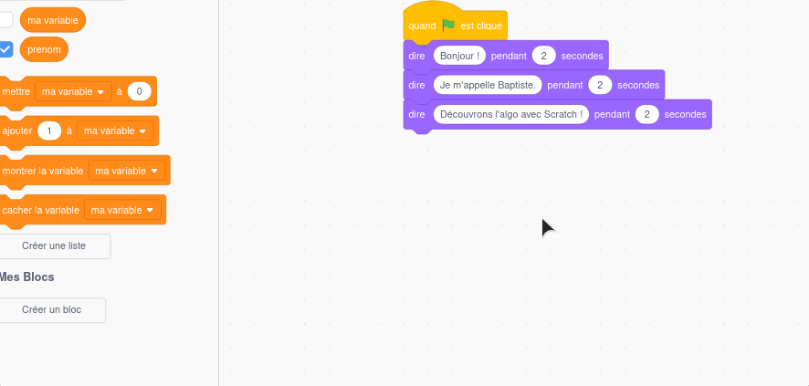

Utilisez ensuite le bloc `mettre "ma variable" à "0"` pour changer la valeur de la variable `prenom`. Vous pouvez bien entendu utiliser **votre** prénom comme valeur 😉

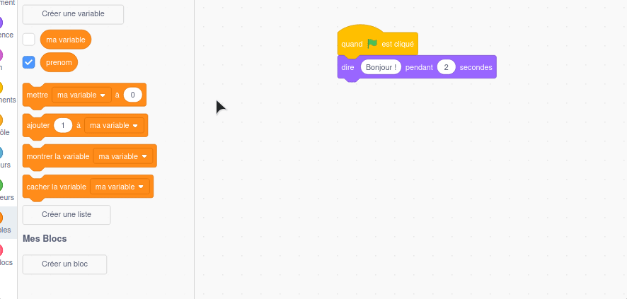

On peut ensuite afficher le contenu de notre variable en combinant deux blocs : le bloc `dire X pendant X secondes` utilisé précédemment, et le bloc `prenom` disponible dans la catégorie `Variables`.

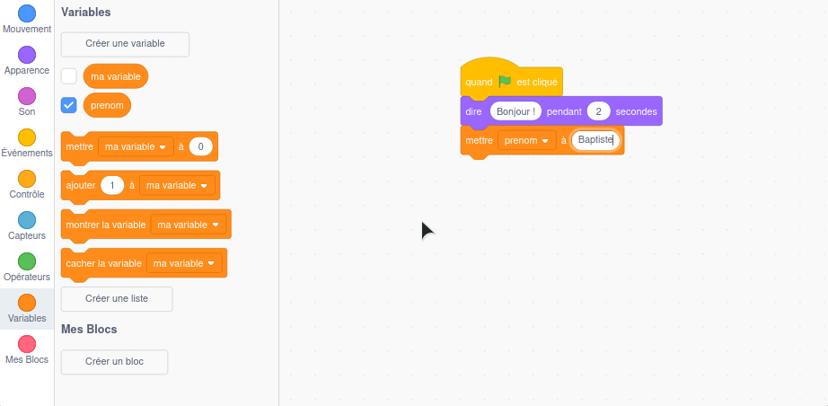

## Tester

Il ne reste plus qu'à tester !

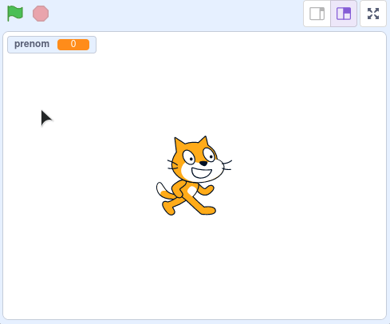

> C'est pas super comme rendu, il faudrait pouvoir dire bonjour en une seule phrase !

Ça tombe bien, c'est possible ! On doit pour cela utiliser le bloc `regrouper X et Y` dans la catégorie `Opérateurs` pour mettre "Bonjour" et notre variable `prenom` bout-à-bout :

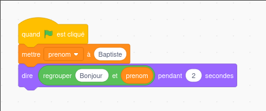  
⬆️ _Vous devez obtenir le résultat ci-dessus !_

Le résultat est déjà plus convaincant !

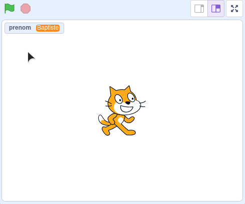

> Et si on veut rajouter le "!" à la fin ?

On peut imbriquer les blocs `regrouper` si nécessaire :

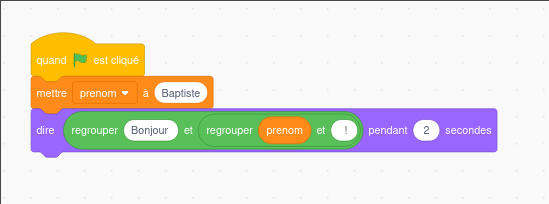

> [!NOTE]
> Si vous voulez écrire "Bonjour Baptiste !" (avec un espace entre le prénom et le "!") pensez à utiliser ` !` (caractère espace suivi du "!") dans le deuxième bloc `regrouper`.

## Demander son prénom à l'utilisateur

> Ce serait bien de pouvoir demander son prénom à l'utilisateur 🤔

Vous me voyez venir ... c'est possible avec Scratch 🎉

On va utiliser pour cela le bloc `demander X et attendre`, disponible dans la catégorie `Capteurs` :

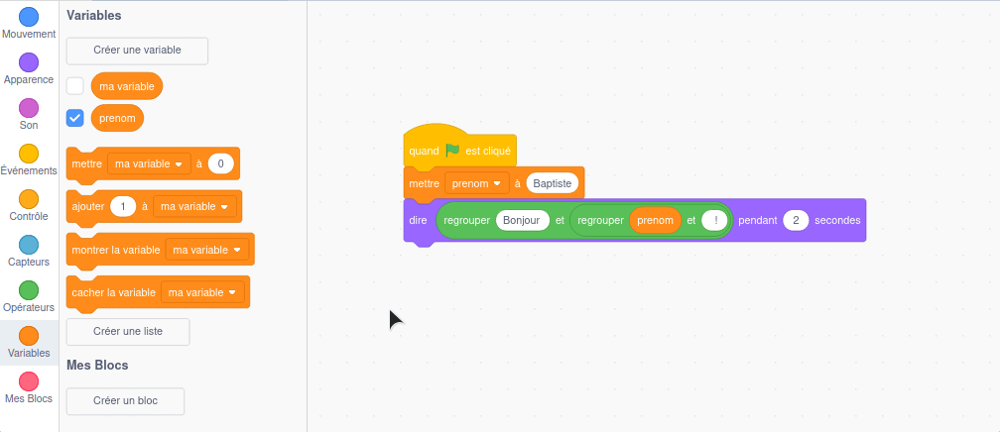

On positionne ce bloc juste après le lancement du programme (avant l'affection de la valeur à notre variable `prenom`).

Ce bloc est un peu particulier : on peut accéder à la réponse saisie par l'utilisateur avec le bloc `réponse` disponible en dessous. On va utiliser le contenu de cette réponse à la place de la valeur de notre variable `prenom`.

Si on teste ce programme, on doit obtenir ce comportement :

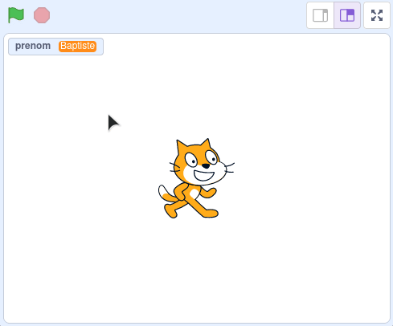

> [!NOTE]
> On peut voir le contenu de la variable `prenom` évoluer au fil du temps dans l'encart en haut à gauche.

## Et ensuite ?

Un peu basique ce programme, n'est-ce pas ? Après les variables, on va découvrir un deuxième concept très important en programmation : les **conditions**.

Ça se passe par [ici](03-conditions.md).