# Les conditions

Pour l'instant, notre programme fait **toujours la même chose** : afficher le prénom de l'utilisateur. Pas génial !

Quand on programme un **algorithme**, on veut en général effectuer certains actions **en fonction de** différents événements ou actions de l'utilisateur. Pour faire cela, on va découvrir une autre brique de base de la programmation : les **conditions**.

> Mais attends, c'est quoi un algorithme ?

## Algorithme

Un algorithme, c'est une suite d'instructions et d'opérations permettant de résoudre un problème spécifique.

Quelques exemples :

- le thermostat de votre chaudière ou d'un radiateur électrique : `SI` la température `EST INFÉRIEURE OU ÉGAL À` 18°C, `ALORS` on allume le chauffage. `SINON`, on éteint le chauffage.
- le système d'authentification d'un utilisateur sur un site web : `SI` l'adresse email et le mot de passe sont corrects, `ALORS` on dit "Bienvenue" à l'utilisateur, `SINON` on lui met un message d'erreur.
- le site de votre banque en ligne : `SI` le solde du compte `EST SUPÉRIEUR STRICTEMENT À` 0€, `ALORS` le solde est en vert, `SINON` il est en rouge.

Ces algorithmes sont implémentés dans des programmes informatiques, avec du code, mais en réalité, les algorithmes sont aussi présents dans notre vie quotidienne, partout autour de nous :

- le videur à l'entrée de la boîte de nuit : `SI` tu as des baskets, `ALORS` tu rentres pas. `SINON`, tu rentres.
- l'examinateur au passage du permis de conduire : `SI` tu écrases un piéton, `ALORS` tu n'auras pas ton permis. `SINON`, `SI` tu respectes le reste du code de la route, `ALORS` tu auras ton permis, `SINON` non.
- le Rubik's Cube peut être résolu en suivant des étapes précises, basées sur une position initiale.
- les procédures de dépannage, le diagnostic médical, les textes de loi, les recettes de cuisine, tout ça sont également assimilables à des algorithmes.

## Représentation graphique d'un algorithme

Voici un algorithme très simple, représenté graphiquement :

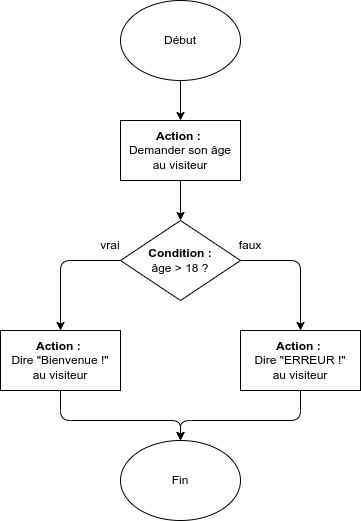

Le début et la fin de l'algorithme sont représentés par **ronds**, les **actions** par des rectangles et les **conditions** par des losanges. Cette représentation est en général appelée **logigramme**, ou **algorigramme**.

> [!NOTE]
> Quand vous devrez coder des algorithmes plus complexes dans les semaines à venir, n'hésitez pas à prendre un papier et un crayon et à d'abord **réfléchir à votre algorithme** en dessinant un logigramme.

## Structures de contrôle & conditions

En programmation, quelque-soit le langage, on va pouvoir utiliser des **structures de contrôles** pour modifier le comportement de notre programme dans certaines **conditions**.

Les structures de contrôle seront toujours de cette forme :

```
SI condition EST vraie
ALORS
    actions à effectuer quand la condition est vraie
```

On peut également rajouter des actions à effectuer quand la condition est fausse :

```
SI condition EST vraie
ALORS
    actions à effectuer quand la condition est vraie
SINON
    actions à effectuer quand la condition est fausse
```

Et enfin, on peut même imbriquer les structures de contrôle entre elles afin de créer des algorithmes plus complexes :

```
SI condition1 EST vraie
ALORS
    SI condition2 EST vraie
        actions à effectuer quand la condition1 est vraie ET que la condition2 est vraie
    SINON
        actions à effectuer quand la condition1 est vraie ET que la condition2 est fausse
SINON
    actions à effectuer quand la condition1 est fausse
```

> Et `condition`, `condition1` et `condition2` dans tout ça, c'est quoi ?

## Opérateurs de comparaison

On va utiliser des opérateurs de comparaison pour écrire nos conditions :

- `A = B` pour tester si A et B sont identiques
- `A != B` pour tester si A et B sont différentes
- `A < B` pour tester si A est strictement inférieur à B
- `A > B` pour tester si A est strictement supérieur à B
- `A <= B` pour tester si A est inférieur ou égal à B
- `A >= B` pour tester si A est supérieur ou égal à B

Reprenons l'algorithme du logigramme précédent et traduisons-le en pseudo-code :

```
SI age > 18
ALORS
    afficher "Bienvenue !" au visiteur
SINON
    afficher "ERREUR !" au visiteur
```

`age > 18` est notre **condition**, et notre code va permettre de **déterminer si cette condition est vraie ou fausse**, et d'effectuer des actions différents en fonction de cela. On dit que la condition sera **évaluée** à vrai ou faux.

> [!NOTE]
> Par abus de langage, on parle souvent de "condition" pour décrire la structure de contrôle dans son ensemble.

## Notre première condition - sur Scratch

Vous vous en doutiez peut-être, on va mettre en place cet algorithme sur Scratch !

Reprenez le code précédent, supprimez les blocs inutiles. Vous allez d'abord devoir créer une nouvelle variable `age`, puis demander son âge au visiteur en utilisant un bloc `demander X et attendre` et enfin stocker la `réponse` de l'utilisateur dans la variable `age`.

Ensuite, en utilisant un bloc `si X alors` ou `si X alors ... sinon` (disponibles dans la catégorie `Contrôle`), **essayez d'implémenter cet algorithme** ! 💪

Pour rappel, vous devez afficher un message "Bienvenue !" si l'utilisateur a strictement plus de 18 ans, "ERREUR !" sinon. Pour écrire votre condition, vous aurez également besoin des **blocs de comparaison** disponibles dans la catégorie `Opérateurs`.

<details>
<summary>Vous vous en sortez ? Si non, la solution par ici !</summary>

Voici à quoi devrait ressembler le début de votre programme Scratch :

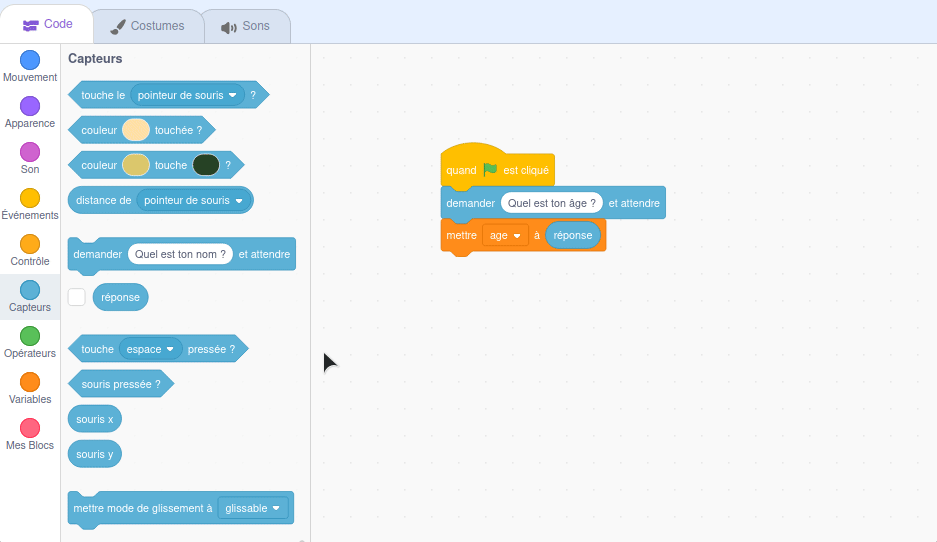

Ça devrait vous aider à terminer de votre coté 💪

<details>
<summary>Vous vous en sortez toujours pas ? 😬</summary>

La solution complète :

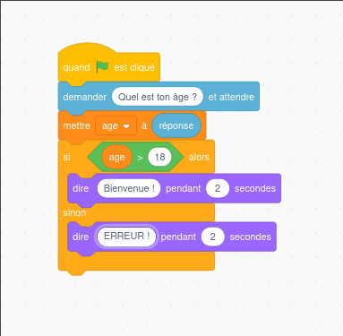

Et le résultat :

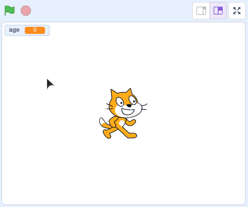

</details>
</details>

## Conditions complexes : opérateurs booléens

Dans certains cas, on va avoir besoin de conditions plus complexes. Prenons un exemple : si l'âge du visiteur est entre 12 et 18 ans, on voudrait lui dire "Bienvenue, jeune visiteur !".

> Mais on a juste vu comment comparer l'âge avec une seule valeur ! 🤔

Pour résoudre ce problème, on pourrait imbriquer deux structures de contrôles, comme mentionné précédemment :

```
SI age < 18
ALORS
    SI age > 12
        actions à effectuer quand le visiteur a entre 12 et 18 ans.
SINON
    actions à effectuer quand le visiteur n'a pas entre 12 et 18 ans.
```

Sur Scratch, ça donnerait quelque-chose comme ça :

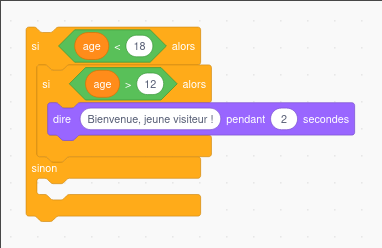

Et on pourrait imbriquer de nombreuses conditions comme ça !

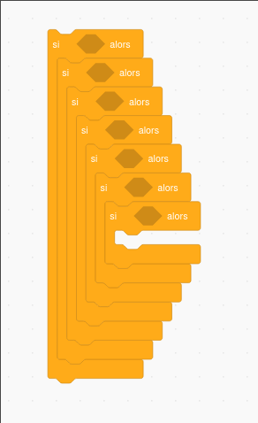

Mais pour éviter de se retrouver à devoir imbriquer plein de conditions de la sorte, on peut utiliser des **opérateurs booléens** !

Il en existe 3 :

- **ET** : permet de tester si une condition A ET une condition B sont vraies
- **OU** : permet de tester si une condition A OU une condition B est vraie
- **NON** : permet d'inverser, vrai devient faux et inversement

Ces trois opérateurs sont disponibles sur Scratch, dans la catégorie ... `Opérateurs`.

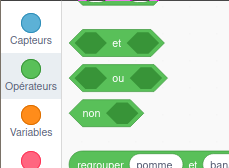

Ce sera plus clair avec un exemple ! Reprenons notre exemple précédent de l'âge du visiteur, on écrire le même algorithme en utilisant l'opérateur booléen **ET** :

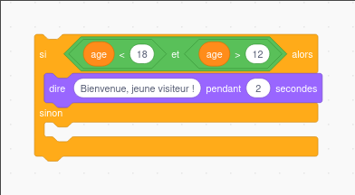

Avec **ET**, **il faut que les deux conditions soient vraies** pour qu'on dise "Bienvenue, jeune visiteur !".

Avec l'opérateur **OU**, **il faut que l'une des deux conditions soit vraie**, exemple :

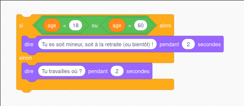

L'opérateur **NON** permet d'**inverser le sens d'une condition** :

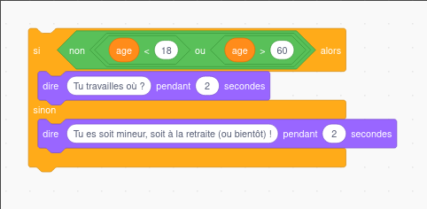

💡 N'hésitez pas à tester ces petits algorithmes sur Scratch !

## Un peu de pratique

Avec la programmation, pour maitriser il faut **pratiquer** ! 💪

Petit exercice : en reprenant ce qu'on a vu précédemment, essayez de créer un programme Scratch qui demande à l'utilisateur son nom d'utilisateur et son mot de passe.

💡 Il faudra créer deux nouvelles variables : `username` et `password`.

Grâce à une (ou plusieurs !) structure de contrôle et une (ou plusieurs !) conditions, vérifiez si le nom d'utilisateur est égal à "admin" et que le mot de passe est égal à "azerty123".

Si le nom d'utilisateur et le mot de passe sont corrects, affichez le message "Bienvenue !", sinon affichez le message "Mauvais nom d'utilisateur ou mot de passe".

Voici le résultat que vous devriez obtenir :

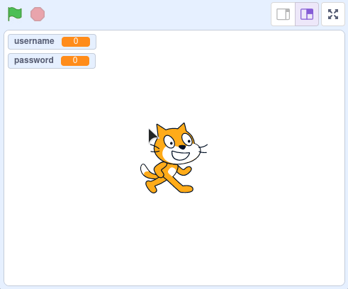

<details>
<summary>La solution (et quelques petites infos intéressantes) par ici !</summary>

Il y a deux façons d'implémenter l'algorithme demandé : avec une seule condition et un opérateur booléen, ou avec deux conditions imbriquées.

Avec un opérateur booléen :


Avec deux conditions imbriquées :

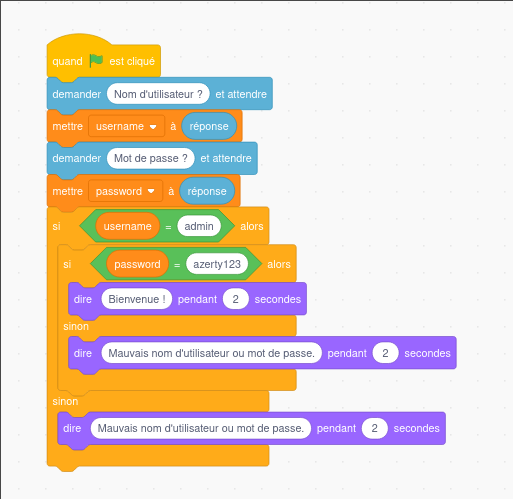

> Laquelle des deux solutions choisir ? Il y en a une qui est "meilleure" que l'autre ?

Vous pouvez choisir la solution que vous préfèrez ! Néamoins, la solution avec deux conditions imbriquées nous force à nous répéter un peu (même bloc `dire X pendant Y secondes` présent deux fois) :

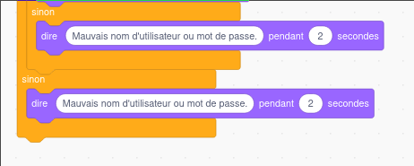

Notre code reste parfaitement fonctionnel, mais en programmation, se répéter, c'est mal !

Imaginez que vous deviez plus tard modifier le message d'erreur : avec la deuxième solution, il faut faire **deux modifications**, dans les deux blocs `dire X pendant Y secondes`.

> Deux modifications au lieu d'une, c'est pas la mer à boire ! En plus avec un petit copier-coller, ça va vite ...

Que deux modifications dans le cas présent ! Vous verrez par la suite que parfois, on peut se retrouver à avoir des morceaux de code qui vont se répéter bien plus que deux fois dans notre code, et il faudra essayer d'éviter ça.

</details>

## Ne pas se répéter

⚠️ Lisez la solution de l'exo précédent, si ce n'est pas encore fait ! (même si vous avez réussi l'exo 😉)

On vient d'en parler : **en programmation, se répéter, c'est mal**.

> [!NOTE]
> Cette "bonne pratique" de ne pas se répéter (quand c'est possible) porte même un nom : **DRY**, acronyme de **Don't Repeat Yourself**. C'est même devenu l'un des **grands principes** de la programmation, qu'il faut tâcher de respecter.

> Mais du coup, si on veut dire 3 fois "Bonjour" de suite, on fait comment ?

Pour ça, il faut qu'on découvre un troisième concept important : les **boucles** !

La suite par [ici](./04-boucles.md).