# Les boucles

Les **boucles**, en programmation, nous permettent de **répéter une action un certain nombre de fois**.

Si on veut dire "Bonjour !" trois fois de suite (sans devoir copier-coller l'instruction `dire X pendant Y secondes` trois fois), on peut utiliser le bloc `répéter X fois` (catégorie `Contrôle`).

À l'intérieur de ce bloc, on met la ou les instructions que l'on souhaite répéter :

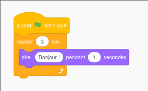

Si vous essayez le programme ci-dessus, vous allez rencontrer un problème : on a l'impression qu'il n'y a qu'un seul message "Bonjour" qui s'affiche pendant 3 secondes ... Pour bien différencier nos 3 messages, on peut rajouter une deuxième instruction :

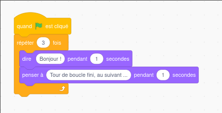

Le résultat :

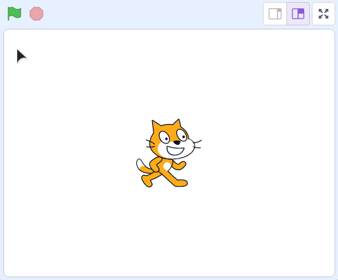

Dans certains **rares** cas, on peut vouloir que **des instructions se répètent à l'infini**. Scratch dispose d'un bloc permettant de le faire (toujours dans la catégorie `Contrôle`) :

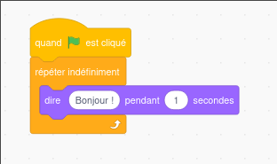

> [!WARNING]
> Les boucles infinies peuvent par exemple servir pour le développement de jeux-vidéos, mais dans notre cas (développement web), on fera plutôt en sorte **d'éviter de faire des boucles infinies** (qui pourraient bloquer le chargement de la page web).

## Boucler, tant que

Souvent, on voudra boucler **tant qu'une condition est vraie** ou **tant qu'une condition est fausse**.

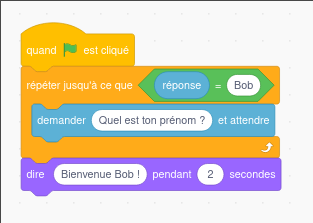

Ici, `réponse = Bob` est ce qu'on appelle la **condition de sortie** de notre boucle. **Dès que** cette condition est vraie, on sort de la boucle et on affiche le message "Bienvenue Bob".

**Tant que** cette condition est fausse, on continue de boucler ! (et on continue de demander le prénom de l'utilisateur, à l'infini !)

Comme tout à l'heure, pour mieux identifier les différents tours de boucle, on peut ajouter une deuxième instruction :

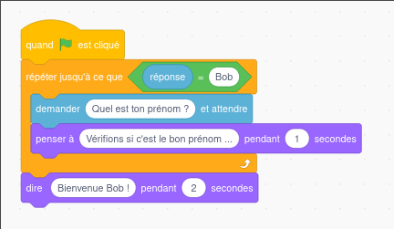

On obtient ce résultat :

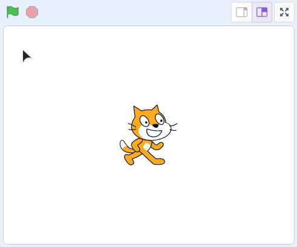

## Boucles : en pratique

Comme d'habitude, vous allez devoir pratiquer un peu !

### Exercice 1

Vous allez devoir modifier le code de l'exercice sur les conditions, dans lequel on demandait un nom d'utilisateur et un mot de passe.

L'idée va être de **boucler**, et de demander à l'utilisateur de saisir son nom d'utilisateur et son mot de passe **tant qu'ils ne sont pas corrects**.

Voici le résultat que vous devez obtenir :

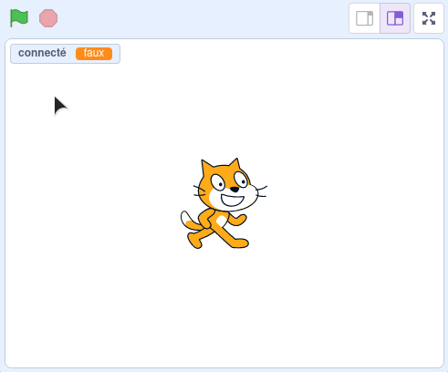

💡 Petit indice : pour obtenir ce résultat, il faudra créer une nouvelle variable, je l'ai appelée `connecté` de mon coté. Au lancement du programme, cette variable vaudra `faux`. Une fois le bon nom d'utilisateur et le bon mot de passe fourni, on peut passer cette variable à `vrai`.

La solution par ici, mais cherchez un peu par vous-même avant !

Avant de vous donner la solution, quelques pistes !

Voici un logigramme de l'algorithme à créer :

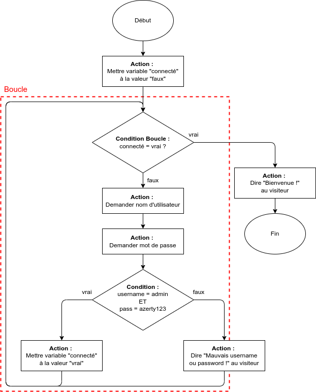

Commencez par mettre en place la boucle, le code **avant** la boucle (avant qu'on entre à l'intérieur et qu'on commence à boucler) et le code **après** la boucle (une fois qu'on en est sorti, **dès que la condition de sortie est vraie**).

Toujours bloqué ?

Voici le code de base de l'algorithme :

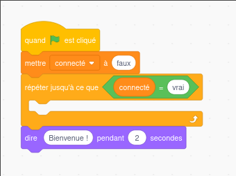

On y retrouve la boucle avec sa condition de sortie, l'initialisation de la variable `connecté` à la valeur "faux" **avant** la boucle, et le message "Bienvenue" **après** la boucle (c'est à dire, une fois l'utilisateur connecté).

Il faut maintenant reprendre l'algorithme de l'exercice précédent, et le mettre à l'intérieur de la boucle ! Au cas où, l'algo de l'exo précédent est ci-dessous :

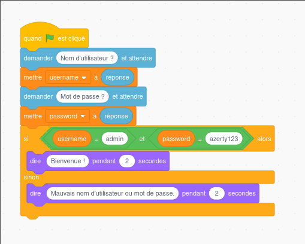

💡 Indice : il ne suffit pas de reprendre l'algo, il va falloir faire une petite modification. Dans l'exercice précédent, si les variables `username` et `password` contenaient les bonnes valeurs, on affichait directement "Bienvenue". Dans notre cas présent, on souhaite plutôt **modifier la valeur de la variable** `connecté`, afin de sortir de la boucle.

Toujours bloqué, bis ?

Pas d'inquiétude, vous êtes-là pour apprendre. 🤗

J'espère quand-même que vous avez **vraiment cherché** avant d'ouvrir la correction ! 👀 Et c'est normal de ne pas trouver immédiatement la solution, l'algorithmie ça demande forcément un temps de **réflexion**.

⚠️ La programmation c'est comme la natation : à un moment donné, il faut se jeter à l'eau pour apprendre. **Si vous ne pratiquez pas, vous ne pourrez pas apprendre à programmer.**

Voici la solution de cet exercice :

**Prenez bien le temps d'analyser et de comprendre comment fonctionne cet algorithme.**

