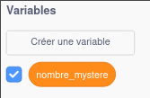
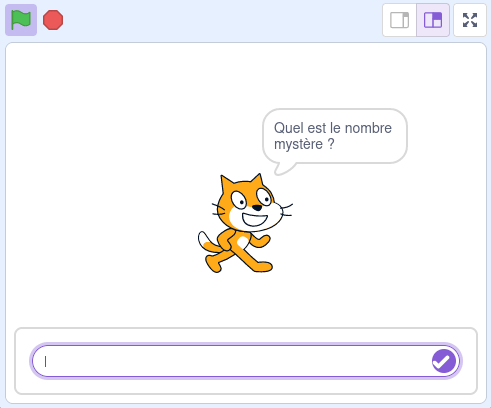
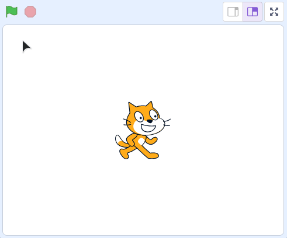
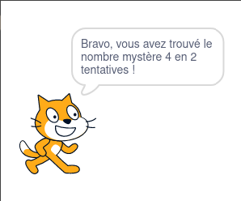

# Atelier : à vous de pratiquer !

Maintenant qu'on a vu les bases, il faut pratiquer 💪

Vous allez devoir "coder" dans cet atelier un **jeu de plus-ou-moins** !

## Règles du jeu

L'utilisateur joue contre l'ordinateur (on pourrait dire "contre l'IA", mais soyons honnêtes, il est encore un peu tôt pour re-coder ChatGPT nous-même).

L'ordinateur commence par **choisir un nombre aléatoire entre 1 et 50**. Ce nombre est stocké dans une variable `nombre_mystere`. Cette variable devra être **cachée à l'utilisateur**, on voit ensemble comment faire ça juste après.

Le joueur doit ensuite deviner ce nombre mystère en un minimum de tentatives !

Tant que le joueur ne trouve pas la bonne réponse, on continue donc de lui demander de deviner et on comptabilise le nombre de tentatives dans une variable `tentatives`.

Après chaque tentative, on indique au joueur si le `nombre_mystere` est supérieur ou inférieur par rapport au dernier nombre tenté.

> Quoi ? Mais comment on peut coder un truc comme ça nous ? 🤯 Je ne sais pas par où commencer !

**Pas de panique** : programmer, c'est **assembler des briques**. On en a découvert quelques-unes dans les premiers fichiers Markdown de ce dépôt (variables, conditions, boucles).

Toute la difficulté réside d'abord dans l'**identification de ces briques**, puis dans leur **assemblage**. On va donc commencer par essayer de décomposer le problème en plusieurs "petits problèmes", plus faciles à résoudre.

## Étapes

Suivez tranquillement les étapes ci-dessous. **Prenez le temps de bien lire les instructions**, devenir développeur web ce n'est pas une course 🙂

### 1. Décomposer

Essayons de décomposer notre problème complexe (le jeu de plus-ou-moins) en plusieurs "petits problèmes" :

- tout d'abord, on nous dit dans les règles qu'il faudra **choisir un nombre aléatoire entre 1 et 50** et **le stocker dans une variable `nombre_mystere`**. On peut redécouper ce problème en deux :
  - Stocker quelque-chose dans une variable, ça on a déjà vu comment faire (il faut utiliser le bloc `mettre "ma variable" à X`) !
  - Et générer un nombre aléatoire ... ça on ne sait pas faire. 🙁 Je vous donne la solution : il faudra utiliser le bloc `nombre aléatoire entre X et Y` disponible dans la catégorie `Opérateurs`.
- on nous demande ensuite de **cacher la variable `nombre_mystere`**, ça on ne sait pas faire non plus ... Plus tard, vous irez chercher sur Google comment résoudre un problème de programmation que vous ne savez pas encore résoudre. Pour gagner un peu de temps, je vous donne la solution : il faudra utiliser le bloc `cacher la variable X` dans la catégorie `Variables`.
- on arrive ensuite sur le "coeur" de notre jeu ! On nous dit dans l'énoncé : **tant que le joueur ne trouve pas la bonne réponse, on continue donc de lui demander de deviner**. Là encore, il faut essayer de décomposer ce problème qui peut sembler insoluble :
  - faire quelque chose **tant qu'une condition est vraie ou fausse**, ça on sait faire ! On va utiliser une **boucle** !
  - **demander à l'utilisateur de saisir quelque-chose** (dans notre cas, le nombre deviné), on sait faire ! On va utiliser le bloc `demander X et attendre` dans la catégorie `Capteurs`.
  - vérifier **si une réponse est correcte ou pas**, on sait faire aussi (on l'avait fait pour le nom d'utilisateur et le mot de passe) ! On va utiliser une **condition** !
  - on devra ensuite **indiquer au joueur si le `nombre_mystere` est supérieur ou inférieur** au nombre deviné.

Il restera la partie "on comptabilise le nombre de tentatives dans une variable `tentatives`", mais notre jeu pourra fonctionner sans ! On peut faire ça dans un second temps, une fois que le jeu est opérationnel.

Allez, c'est parti, au boulot 💪

### 2. Nouveau projet

Créez un nouveau projet Scratch (Menu `Fichier` > `Nouveau`).

### 3. Variable `nombre_mystere`

Commencez par créer une nouvelle variable appelée `nombre_mystere` (si vous ne vous souvenez plus comment faire, retournez voir le fichier [02-variables.md](./02-variables.md)).

Ensuite, on va avoir besoin du bloc `mettre "ma variable" à X` pour affecter une valeur à cette variable.

La valeur qu'on veut affecter à cette variable est un **nombre aléatoire entre 1 et 50** : utilisez le bloc `nombre aléatoire entre X et Y` (catégorie `Opérateurs`) **pour générer la valeur de la variable `nombre_mystere`**.

Et pour finir ... cachez cette variable avec le bloc `cacher la variable X`.

### 4. Boucle de jeu

On doit **boucler tant que le joueur ne trouve pas la bonne réponse**. Ajoutez la boucle permettant de répéter des instructions **tant qu'une condition fausse.** (on l'a déjà utilisée !)

Dans notre boucle, on sait qu'on va demander au joueur de **deviner un nombre** : ajoutez le bloc `demander X et attendre` à l'intérieur de la boucle.

Il faut ensuite s'occuper de la **condition de sortie** de notre boucle : si le nombre deviné (la réponse de l'utilisateur) **est égal** au nombre mystère, on sort de la boucle !

💡 Rappel : avec le bloc `demander X et attendre`, ce que l'utilisateur a saisi est disponible dans le bloc `réponse` (dans la catégorie `Capteurs`).

### 5. Après la boucle & premier test

Si on sort de la boucle, c'est que le joueur a trouvé le nombre mystère ! Ajoutez un bloc `dire X pendant Y secondes` après la boucle afin de le féliciter.

Et si on testait ?

> Euh, c'est pas facile du tout comme jeu 😅

Effectivement, il va faloir être très chanceux (ou persévérant) pour trouver le nombre mystère sans aucune indication ...

Pendant vos tests, vous pouvez réafficher la valeur de la variable `nombre_mystere` en cochant la case à coté de son bloc dans la catégorie `Variables` **après avoir lancé le jeu** :

À ce stade, tant que le joueur ne devine pas le nombre mystère, on lui demande de deviner à nouveau. Dès que le nombre mystère est trouvé, un message "Bravo !" devrait s'afficher.

Si c'est n'est pas le cas, **inutile d'aller plus loin** : relisez bien les étapes précédentes, essayez de voir si vous n'avez rien oublié ! Si vraiment vous bloquez, quelqu'un sur le canal `#entraide` sur Slack pourra peut-être vous aider 😉

### 6. Plus ou moins

Pour l'instant, notre jeu est très compliqué ... on va donc aider un peu le joueur, en lui indiquant **après** chaque tentative si le nombre mystère est supérieur ou inférieur au nombre deviné.

- Si le nombre mystère est strictement supérieur, on affichera un message "C'est plus !".
- Si le nombre mystère est strictement inférieur, on affichera un message "C'est moins !".

Pour afficher un message, utilisez le bloc `dire X pendant Y secondes`, comme d'habitude.

Et déterminer quel message afficher ... vous devrez utiliser une ou plusieurs **conditions** !

Ajoutez ces nouveaux blocs à l'intérieur de la boucle, et configurez les deux conditions (`réponse > nombre_mystere` ou `réponse < nombre_mystere`).

Voici le résultat que vous devriez obtenir à cette étape :

Ça y est, le jeu est fonctionnel 🎉

Il nous reste à comptabiliser le nombre de tentatives, on fait ça à l'étape suivante.

### 7. Comptabiliser les tentatives

Pour stocker le nombre de tentatives, il va nous falloir une nouvelle variable `nb_tentatives`. Vous pouvez la créer dès maintenant.

Au lancement du programme, **avant** la première tentative du joueur, `nb_tentatives` va valoir 0. Pensez à définir cette valeur par défaut avec le bloc `mettre "ma variable" à X` au tout début du programme.

**Après chaque tentative**, nous allons ajouter 1 à la variable `nb_tentatives`. Vous pouvez pour cela utiliser le bloc `ajouter X à "ma variable"` (catégorie `Variables`).

À la fin du programme, une fois le nombre mystère trouvé, il faudra afficher un message au joueur indiquant **en combien de tentatives il a trouvé le nombre mystère**.

Avec les blocs `dire X pendant Y secondes` et `regrouper X et Y` (dans la catégorie `Opérateur`, pour assembler plusieurs variables et textes), essayez d'afficher le message "Bravo, vous avez trouvé le nombre mystère X en Y tentatives !" :

### C'est fini !

Ce coup-ci c'est bon, on a fini de programmer notre premier jeu 🎉 Ok, c'est pas le jeu de l'année, mais il faut bien commencer quelque-part.

⚠️ Retenez bien la **démarche** que nous avons adopté : on est parti d'un problème complexe, qui pouvait nous semblait insoluble. On a **découpé ce problème complexe en plusieurs sous-problèmes**, plus simples à résoudre.

On a implémenté le jeu **étape par étape**, petit problème par petit problème. Pour chaque projet de programmation, que ce soit la création d'un jeu vidéo ou le développement d'un site web, on suivra la même démarche.

Et si vous vous ennuyez, il y a quelques bonus disponibles par [ici](./06-bonus.md).
