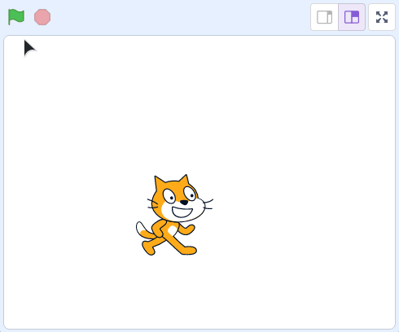

# Atelier : Bonus

Si vous voulez aller plus loin, quelques pistes ! C'est du bonus, donc ce sera beaucoup moins guidé : c'est à vous de chercher un peu ! 💪

## Enchainer les parties

Une fois le nombre mystère trouvé, on pourrait **proposer à l'utilisateur de refaire une nouvelle partie**.

Il faudra pour cela ajouter une nouvelle boucle pour englober tous les blocs qu'on a déjà utilisé.

## Meilleur score

S'il est possible d'enchainer les parties, il pourrait être intéressant de **conserver le meilleur score** !

Dès qu'un joueur bat ce meilleur score, on le met à jour et on lui affiche un message de félicitations.

## Nom du joueur

Quand un joueur bat le meilleur score, on pourrait lui demander son nom.

Une fois ce meilleur score battu par un autre joueur, on pourrait afficher un message "Bravo, vous avez battu le meilleur score de Bob, qui avait trouvé le nombre mystère en X tentatives !".

## Fin du jeu

Après avoir mis en place la possibilité d'enchainer les parties, si l'utilisateur veut arrêter de jouer, on peut lui dire "Au revoir !".

On pourrait aussi déplacer le chat vers la droite de l'écran (il faudra chercher un peu pour ça 😈), comme s'il quittait l'écran.

Au lancement du jeu, il faudra remettre le chat à au centre de l'écran (x: 0, y: 0).

## Organisation

Ça devient un peu le bazar dans notre programme, avec toutes ces fonctionnalités, non ?

Pour ranger un peu votre code, vous pouvez créer des **blocs personnels** (dans la catégorie `Mes Blocs` !) et ranger plusieurs instructions à l'intérieur de ces blocs.

Ces blocs peuvent ensuite être utilisés dans votre programme comme n'importe quel autre bloc.

## Rendu final

Voici le rendu final du jeu, avec l'ensemble des fonctionnalités bonus implémentées et quelques fioritures (message d'accueil, message au lancement d'une nouvelle partie, etc.) :

